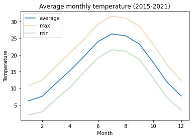

# BP Weather Challenge

## Data
Starting data:
- Temperature Data.csv
- Population Data.csv

Cities vs Stations

There are no coordinates for stations. I used the Population table to get latitude/longitude for the Temperature table, where possible (34/37). We don't have full coverage, but we can estimate local temperatures in cities by looking at neighbor stations.

Final timeseries: *data/final/daily_temps_interpolated.csv*

## Method
1) Interpolate missing daily temperatures of stations, using the neighboring days. A few days have just 1 station up, but outages are always separated by a few days.

2) For every city, find the 3 nearest weather stations and estimate local (mean, min, and max) temperatures every day using "inverse distance weighting", so closer stations have a much larger impact.

3) Each day, compute the population weighted average temperature of the US, using every city (285).  
T_avg = ((pop_1)(temp_1) + ... + (pop_n)(temp_n))/(pop_1 + pop_2 + ... pop_n)

4) Now we can plot the seasonal and monthly average, max, min. I guess this is the average temperature felt by someone in the US on a given day (and the average minimum temperature felt by someone, etc).

as well as the average, min, max monthly:

## Code
- infer_daily_US_temperatures.ipynb: generate daily timeseries
- plotting_temperatures_final.ipynb: plotting
- engineer_data.py: functions for data manipulation
- infer_temperature.py: functions for getting temperature + more

### Packages
matplotlib, pandas, numpy, jupyter, folium